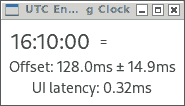

# UTC Engineering Clock

`eng-clock` is a simple Rust application that shows a live display
of the current time, but taking particular care to accurately synchronize
screen updates to transitions from one second to the next.
(Note that some desktop clock applications may simply provide updates
every second, but at an arbitrary offset from these second boundaries.)

The application sends its own NTP requests to feed into a statistical estimator
of the local system clock's offset from authoritative time references,
including an estimate of the accumulated margin of error.
(That offset estimator is based on a simple Bayesian Inference process
assuming Gaussian statistics.)
This statistical estimator includes a model of how the imprecision
in the clock synchonization may drift in the absence of NTP updates,
and that is used to determine dynamically when the next NTP request
should occur.

The visual display is deliberately minimalistic, using only basic
[GTK](https://gtk-rs.org/) elements.

## Compilation

`eng-clock` can be built using the standard
[Cargo](https://doc.rust-lang.org/cargo/) recipe:

    cargo build --release

or for a smaller executable that uses platform-provided shared libraries:

    RUSTFLAGS="-C prefer-dynamic" cargo build --release
    strip target/release/eng-clock

## Configuration

On startup the application will read configuration settings
from `${HOME}/.config/eng-clock.toml` (or the equivalent directories
provided by [dirs::config_dir()](https://docs.rs/dirs/5.0.1/dirs/fn.config_dir.html)).

The application has a built-in set of default NTP servers,
based on [`pool.ntp.org`](https://www.ntppool.org).
More region-specific servers can be configured by including
an entry of the form:

    [sync]
    ntp_servers = [
        "1.africa.pool.ntp.org",
        "1.asia.pool.ntp.org",
        "1.europe.pool.ntp.org",
        "1.north-america.pool.ntp.org",
        "1.oceania.pool.ntp.org",
        "1.south-america.pool.ntp.org"
    ]

## Licensing

All files are released under the
[GPL-v3](https://www.gnu.org/licenses/gpl-3.0.en.html)
and are Copyright (C) 2023 RW Penney.
